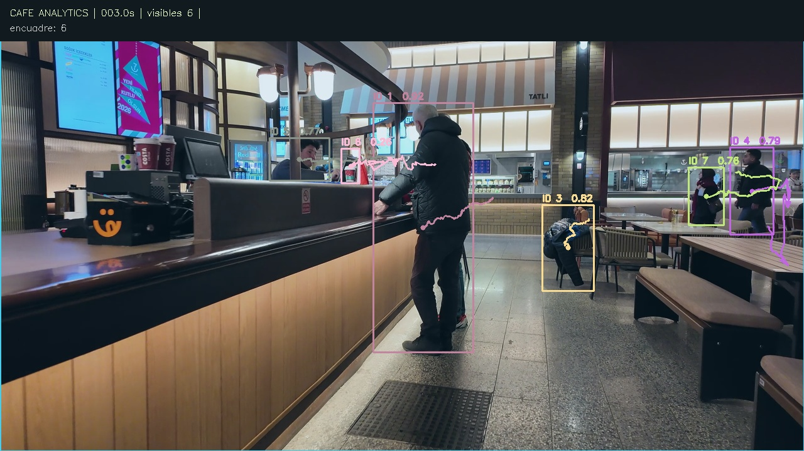
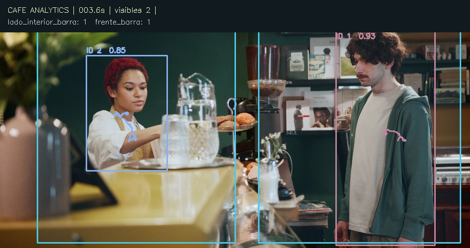
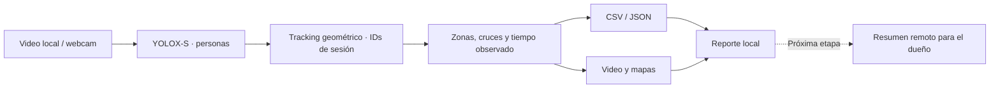

<div align="center">

# Café Analytics

### Entiende qué pasa en tu negocio, aunque no estés ahí.

Analytics local de personas para cafeterías y tiendas. Convierte video en evidencia de ocupación, permanencia y flujo para apoyar decisiones de operación.

[**Ver demo con video →**](https://juliosuas.github.io/cafe-analytics/) · [Guía de instalación](docs/USAGE.es.md) · [Para dueños de negocio](docs/OWNER_GUIDE.md) · [Roadmap](docs/ROADMAP.md)

[](https://github.com/juliosuas/cafe-analytics/actions/workflows/tests.yml)


</div>

[](https://juliosuas.github.io/cafe-analytics/#operacion)

> **Estado actual:** MVP que analiza archivos locales y ofrece captura opcional de webcam. El monitoreo desatendido, las alertas y los reportes diarios automáticos son la siguiente etapa; todavía no están implementados. Las personas del video no respaldan este proyecto.

## El problema que queremos resolver

El dueño no necesita pasar horas viendo cámaras. Necesita saber **cuándo hubo más actividad, dónde se concentró, qué cambió y qué merece una revisión**. La meta es entregarle un resumen de operación con evidencia y acciones posibles, sin depender de su presencia física.

El MVP construye la base medible de ese producto. Separa tres cosas: lo que la cámara observó, lo que podemos interpretar y lo que requiere información adicional.

| Pregunta del dueño | Evidencia disponible hoy | Decisión que podría apoyar con una muestra suficiente |
|---|---|---|
| ¿En qué zonas se concentró la gente? | Ocupación observada y persona-segundos por zona | Revisar distribución, señalización o capacidad |
| ¿Hubo permanencias inusuales junto a la barra? | Duración observada por visita e ID | Revisar episodios antes de atribuirlos a espera |
| ¿Cómo se movieron entre áreas? | Trayectorias y cruces de líneas calibradas | Evaluar circulación y puntos de congestión |
| ¿Qué cambió entre horarios? | Exportaciones con timestamps | Comparar sesiones equivalentes; agregación diaria pendiente |
| ¿Necesito más personal? | La cámara aporta parte de la evidencia | Combinar afluencia, espera validada y ventas antes de cambiar turnos |

**No inferimos compras, abandono de fila, productividad individual o satisfacción a partir de estas métricas.** Para ventas y conversión se necesitará integrar el punto de venta. Ver [guía de decisiones](docs/OWNER_GUIDE.md).

## Lo que ya funciona

- **Personas e IDs por sesión:** YOLOX-S con ONNX Runtime y tracking geométrico original.
- **Zonas dibujadas sobre tu video:** editor HTML local, polígonos y líneas de acceso.
- **Permanencia y flujo:** tiempo observado, visitas parciales, ocupación máxima y cruces bidireccionales.
- **Evidencia visual:** video anotado, trayectorias y heatmap en persona-segundos.
- **Lectura para el dueño:** resumen de sesión y ocupación por fotograma, con instantes de evidencia.
- **Datos portables:** CSV y JSON, más reportes HTML que funcionan sin servidor.
- **Procesamiento local:** sin cuenta, clave de API ni servicios de inferencia después de instalar y descargar los assets.
- **Sin biometría:** no hay reconocimiento facial ni inferencias de edad, género o emoción.

## Video principal: varias personas en una cafetería

La [portada](https://juliosuas.github.io/cafe-analytics/) presenta **un único video protagonista** de 10.28 segundos, con varias personas a ambos lados del mostrador y seguimiento ejecutado por el MVP. Reproducción silenciosa en bucle, pausa visible y respeto a la preferencia de movimiento reducido. Fuente: [Sururi Ballıdağ Director / Pexels 35545660](https://www.pexels.com/video/busy-cafe-with-customers-ordering-at-counter-35545660/).

**Cámara móvil:** esta demo muestra detección, IDs y ocupación del encuadre completo. No sirve para interpretar trayectorias como recorridos físicos ni para medir espera por zonas. No clasifica roles ni cuenta tazas. [Reporte](https://juliosuas.github.io/cafe-analytics/flow/report.html) · [Procedencia y licencia](SOURCES.md).

```bash
python scripts/download_assets.py --demo cafe-flow
cafe-analytics run --source assets/cafe-flow.mp4 --config configs/cafe-flow.json --output runs/cafe-flow --width 1280
python scripts/verify_run.py runs/cafe-flow
```

## Demo de cafetería de barra

[Ver demo técnica de barra](https://juliosuas.github.io/cafe-analytics/cafe/report.html) · [Resumen para el dueño](https://juliosuas.github.io/cafe-analytics/cafe/owner.html) · [Reporte técnico](https://juliosuas.github.io/cafe-analytics/cafe/report.html)



**36 segundos, 900 fotogramas y dos zonas de imagen.** Video de [Ron Lach / Pexels 8430969](https://www.pexels.com/video/man-ordering-at-a-cafe-8430969/), con [licencia separada](SOURCES.md). El encuadre oculta pies; se usa centro de caja y no se estiman posiciones físicas en el piso. No hay acceso visible: entradas y salidas están **no disponibles**, no en cero. La detección no distingue empleados de clientes.

Cada ejecución produce ahora `occupancy.csv`, `owner-summary.json` y `owner.html`: ocupación por fotograma, primeros máximos con enlace al video, hechos observados y preguntas de revisión. La media de permanencia conserva episodios parciales; no se transforma en espera ni en recomendación de personal.

La primera [demo de supermercado](https://juliosuas.github.io/cafe-analytics/report.html) sigue disponible: Suika Chan / Pexels 10901926, 341 fotogramas. [Ejecuciones, resultados y límites](VERIFICATION.md).

## Dos superficies, una dirección

- **[Web pública](https://juliosuas.github.io/cafe-analytics/):** utilidad para el dueño, video real, resumen de sesión y seis casos de negocio explorables.
- **GitHub:** motor, configuración, pruebas y backlog técnico. Los casos de panadería, comida para llevar, tienda, barbería/salón y lavandería son hipótesis por validar, no clientes ni beneficios demostrados.

[Dirección de producto y prioridades técnicas](docs/PRODUCT_STRATEGY.md).

## Ejecuta la demo local

Recomendado: Python 3.12, FFmpeg y cámara fija o video propio. La primera instalación necesita internet. Los modelos y el video original se descargan por separado y se verifican con SHA256.

```bash
git clone https://github.com/juliosuas/cafe-analytics.git
cd cafe-analytics
python3.12 -m venv .venv
source .venv/bin/activate
python -m pip install -e '.[test]'
python scripts/download_assets.py --demo cafe
cafe-analytics run --source assets/cafe-counter.mp4 --config configs/cafe-counter.json --output runs/mi-demo
```

Abre `runs/mi-demo/owner.html` para el dueño o `runs/mi-demo/report.html` para las métricas técnicas. El código rechaza carpetas de salida que ya contienen datos.

**macOS Apple Silicon:** `brew install python@3.12 ffmpeg`. **Ubuntu 22.04/24.04:** instala `python3 python3-venv python3-pip ffmpeg libgl1 libglib2.0-0`; usa `python3` en lugar de `python3.12` cuando corresponda. [Instalación completa y solución de problemas](docs/USAGE.es.md).

### Tu propio video

```bash
cafe-analytics configure --source /ruta/cafeteria.mp4 --output mi-editor.html
# Abre mi-editor.html, dibuja las zonas y descarga zonas.json.
cafe-analytics run --source /ruta/cafeteria.mp4 --config zonas.json --output runs/cafeteria-01
```

### Webcam opcional

```bash
cafe-analytics configure --webcam 0 --output editor-webcam.html
cafe-analytics run --webcam 0 --config zonas.json --output runs/webcam-01 --max-seconds 60 --preview
```

La cámara física no se verificó en la entrega inicial. El video de webcam se escribe a FPS nominales; sus tiempos analíticos provienen del reloj de captura. `Q` o `Ctrl+C` finaliza y guarda.

## Arquitectura



[Arquitectura y decisiones técnicas](docs/ARCHITECTURE.md) · [Configuración](docs/CONFIGURATION.md) · [Contrato de datos](docs/DATA_MODEL.md)

## Verificación

**0.1.1, ejecución local del 8 de octubre:** 25 tests aprobados y 900/900 frames de cafetería procesados y verificados. El filtro calibrado redujo de 6 a 2 IDs en ese clip; no es un benchmark independiente. [Antes/después y evidencia](VERIFICATION.md#demo-de-barra-y-mejoras-011--8-de-octubre-de-2026).

**CI del 8 de octubre de 2026:** 12 pruebas aprobadas y 341/341 frames procesados tanto en Ubuntu 24.04 como en macOS 14 arm64, con Python 3.12. [Ver ejecución](https://github.com/juliosuas/cafe-analytics/actions/runs/37886562901). La webcam física sigue pendiente.

```bash
python scripts/download_assets.py  # añade retail para las pruebas de inferencia
python -m pytest -q -W error
python scripts/verify_run.py runs/mi-demo
```

Las pruebas cubren tiempo, oclusiones, persistencia de ID, histéresis, dirección de cruce, geometría, inferencia ONNX real y la rama webcam con una fuente simulada. Las pruebas de inferencia requieren assets; sin ellos se omiten explícitamente. [Cómo reproducir y validar un piloto](docs/VALIDATION.md).

## Próxima etapa: de métricas a decisiones

1. **Validar calidad:** cámara fija, accesos reales, conteo manual y errores medidos.
2. **Operación desatendida:** reconexión, salud de cámara, sesiones y almacenamiento local.
3. **Resumen para el dueño:** día/turno, comparación con su línea base y evidencia de excepciones.
4. **Recomendaciones verificables:** hipótesis de mejora, acción elegida y medición posterior.
5. **Integración con ventas:** POS para responder preguntas de conversión y operación.

El [roadmap](docs/ROADMAP.md) define criterios de aceptación; no presenta funcionalidades futuras como disponibles.

## Documentación y colaboración

- [Guía para el dueño](docs/OWNER_GUIDE.md): preguntas, decisiones y límites.
- [Guía de uso](docs/USAGE.es.md): macOS, Ubuntu, video y webcam.
- [Privacidad y operación](docs/PRIVACY.md): datos guardados y retención.
- [Contribuir](CONTRIBUTING.md), [seguridad](SECURITY.md) y [cambios](CHANGELOG.md).
- [Licencias de terceros](THIRD_PARTY.md) y [procedencia](SOURCES.md).

## Licencia y origen

Código propio bajo **Apache-2.0**. Componentes principales: YOLOX (Apache-2.0), ONNX Runtime (MIT), NumPy y SciPy (BSD). OpenCV y sus binarios incluyen avisos adicionales; FFmpeg es opcional y externo. El video y sus derivados conservan la licencia separada de Pexels.

Este es un **repositorio original**, no un fork del código de YOLOX ni de Retail-Store-Video-Analytics. Utiliza los pesos oficiales de YOLOX y adapta su preparación/decodificación de entradas y salidas con atribución en [NOTICE](NOTICE). El tracker y la analítica son propios. No se incluye el paquete Ultralytics.
