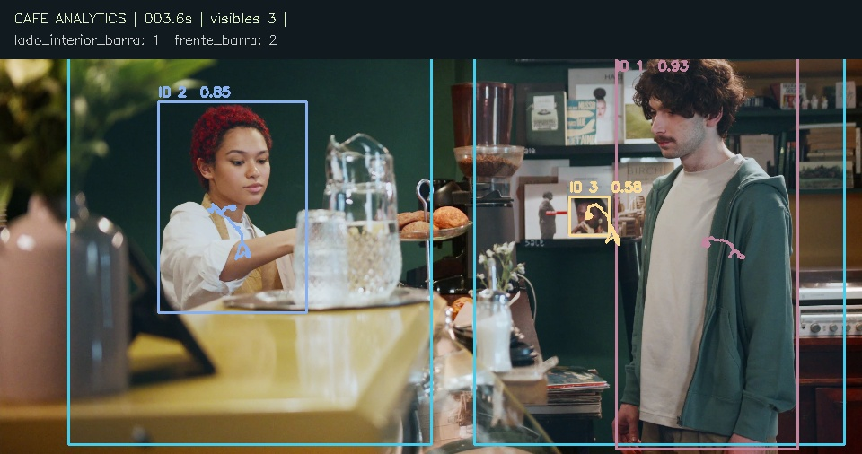

# Verificación de la entrega

Fecha: 3 de octubre de 2026. Entorno real: macOS-15.7.4-arm64-arm-64bit; Python 3.12.14; CPUExecutionProvider, 4 hilos. No se usó GPU.

## Ejecución completa con video público

- Video real: Suika Chan / Pexels 10901926. Fuente y licencia en `SOURCES.md`.
- Modelo oficial YOLOX-S, inferencia ONNX real, sin detecciones simuladas.
- Fotogramas procesados: **341 de 341**.
- Duración del video: **11.3667 s**.
- Tiempo del bucle de procesamiento: **36.24 s**.
- Velocidad media: **9.41 FPS**. Excluye inicialización del modelo, conversión final H.264 y escritura final del reporte; no es una promesa de tiempo real.
- IDs confirmados: **30**; no se afirma que sean personas únicas reales.
- Muestras de trayectorias: **5002**.
- Cruces de la línea virtual: **1 entrada, 0 salidas**; no es una puerta real.
- Video generado: **H.264, 960 × 540, 30 FPS, 341 fotogramas**, sin audio.
- Ejecución final completa con `python -W error`; terminó sin advertencias ni excepciones.

## Pruebas e integridad

**12 pruebas aprobadas** con `pytest -q -W error`:

1. Tiempos basados en observación y exclusión de huecos largos.
2. Cruces en ambos sentidos e histéresis frente a oscilación.
3. Cruces de la prolongación fuera del segmento no se cuentan.
4. Reaparición tras pérdida no genera un cruce ficticio.
5. Métricas vacías sin personas.
6. Cierre de visitas al salir de una zona.
7. Rechazo de coordenadas inválidas y polígonos cruzados.
8. Persistencia de ID ante oclusión corta y detección de baja confianza; nuevo ID tras expiración.
9. Detección débil no crea IDs nuevos.
10. El orden de las detecciones no cambia la asignación de IDs.
11. Detector real encuentra personas en el video y ninguna en imagen negra.
12. Rama webcam con seis frames de video real como cámara simulada, FPS desconocidos, timestamps monotónicos y exportación MP4V sin FFmpeg. No abre una cámara física.

`python scripts/verify_run.py runs/demo` aprobó: decodificación completa de los 341 frames de salida, correspondencia entre IDs, CSV/JSON y eventos, permanencias no negativas, e igualdad entre persona-segundos observados y heatmap (176.033333). Evidencia estructurada en `runs/demo/verification.json`.

Instalación editable `pip install -e '.[test]'` y comando `cafe-analytics --help` comprobados. Descargador ejecutado con assets presentes: ambos SHA256 correctos. Los archivos originales se descargaron de las URLs públicas documentadas durante esta sesión.

## Navegador

- Reporte abierto y revisado visualmente en navegador integrado.
- Reproductor: readyState 4, duración 11.366667 s, ancho 960, sin error de medio.
- Editor: imagen cargada; dibujo y guardado de un polígono; línea de acceso e inversión de dirección.
- Descarga `zonas.json` efectuada desde el editor y validada posteriormente por `validate_config`: una zona, un acceso y dirección invertida correcta.

## Límites de lo verificado

En la entrega inicial del 3 de octubre no se ejecutó en Ubuntu ni con una webcam física. La publicación del 8 de octubre añade la prueba de Ubuntu en CI, detallada abajo; webcam física sigue pendiente. No se midieron precisión, recall, ID switches, error de aforo o dwell contra anotaciones humanas. La demo tiene oclusiones y recortes de cuerpos. La prueba de funcionamiento no certifica exactitud comercial. Para un piloto, fijar la cámara, definir accesos reales y comparar manualmente cruces y permanencias durante una muestra representativa.

## Publicación pública y CI — 8 de octubre de 2026

Ejecución: [GitHub Actions 37886562901](https://github.com/juliosuas/cafe-analytics/actions/runs/37886562901), commit `d9398fc406404f26b3c294e535585dcb1ebb841a`. Los registros usan UTC del 9 de octubre; corresponden a la noche del 8 de octubre en America/Mexico_City.

| Entorno alojado por GitHub | Tests | Frames procesados/decodificados | IDs confirmados | Muestras | Cruces | FPS de procesamiento |
|---|---:|---:|---:|---:|---:|---:|
| Ubuntu 24.04, Python 3.12 | 12 aprobados | 341 / 341 | 31 | 5,078 | 1 | 4.84 |
| macOS 14 arm64, Python 3.12 | 12 aprobados | 341 / 341 | 30 | 5,002 | 1 | 2.90 |

Ambos entornos instalaron desde `pyproject.toml`, descargaron los assets oficiales, verificaron sus hashes, ejecutaron inferencia real y aprobaron el verificador completo de video/CSV/JSON/heatmap. La verificación de documentación aprobó 18 archivos y 53 destinos locales. Los artefactos de cada ejecución están disponibles temporalmente en Actions.

**Reproducibilidad funcional, no identidad numérica entre plataformas:** Ubuntu produjo 31 IDs y macOS 30 en el mismo clip. El origen preciso de la diferencia no se investigó en esta publicación. No se promete una salida idéntica entre runtimes/hardware, y los IDs no deben usarse como conteo exacto de clientes únicos. El protocolo de piloto debe medir error en el entorno de despliegue. Los FPS de runners compartidos no son comparables directamente con la referencia local.

La nueva ejecución local se detuvo por esperas de lectura de archivos en el entorno existente; no se contó como una prueba aprobada. La evidencia de esta publicación proviene de los runners completos de GitHub y de la ejecución local histórica documentada arriba.

GitHub Pages publicó la demo por HTTPS. Se revisaron los destinos locales antes de publicar. No se efectuó una auditoría de seguridad ni validación comercial de exactitud.

## Demo de barra y mejoras 0.1.1 — 8 de octubre de 2026

Entorno local nuevo: macOS 15.7.4 arm64, Python 3.12.12 de Homebrew, ONNX Runtime CPU, 4 hilos. Instalación editable limpia en entorno aislado. Se ejecutó el clip completo de Ron Lach / Pexels 8430969, sin detecciones simuladas, primero sin filtro y después con `configs/cafe-counter.json`.

| Medición del mismo clip | Sin filtro de tamaño | Con mínimo de altura 0.20 |
|---|---:|---:|
| Frames procesados y decodificados | 900 / 900 | 900 / 900 |
| IDs confirmados | 6 | 2 |
| Pico en frente de barra | 3 | 1 |
| Muestras de trayectoria | 2,518 | 1,631 |
| Persona-segundos totales | 103.04 | 65.16 |

La revisión del fotograma 90 (3.6 s) encontró una figura impresa del fondo detectada como persona. Una prueba de inferencia real verifica que el filtro conserva las dos personas físicas de ese fotograma. **Es una calibración sobre el mismo clip, no una validación independiente de precisión.** El filtro puede excluir personas reales pequeñas en otras vistas. Los 1,126 registros de detección descartados son muestras por fotograma, no personas ni falsos positivos confirmados individualmente.

| Antes: figura del fondo contada | Después: filtro explícito de cámara |
|---|---|
|  |  |

Resultado final: H.264 960×506, 25 FPS, 36 s; bucle de inferencia 216.20 s (4.16 FPS). Es una referencia de ejecución local, no garantía de tiempo real. No hay líneas de acceso: el resumen para el dueño marca entradas/salidas como no disponibles. Ambas visitas están marcadas parciales. Frente de barra: 29.28 persona-segundos; lado interior: 35.88. No son tiempos de espera o atención.

**25 tests aprobados** con `python -m pytest -q -W error`: incluye detector real, cámara simulada, regresión del cartel, configuración del filtro, ocupación por frame, evidencia de picos, ausencia de acceso, escape HTML y diferencia entre tiempo de captura/reproducción. El verificador completo aprobó los 900 frames del MP4, CSV/JSON, 1,800 filas de ocupación (dos zonas), primeros picos y conservación de 65.16 persona-segundos en heatmap y pistas.

Evidencia publicada: [verificación](docs/cafe/verification.json), [comparación](docs/cafe/calibration-comparison.json), [resumen técnico](docs/cafe/summary.json) y [resumen para el dueño](docs/cafe/owner-summary.json). Fuente, descarga y SHA256 del original en [SOURCES.md](SOURCES.md). Las afirmaciones de CI de la sección anterior corresponden a 0.1.0; el resultado de la nueva ejecución se documentará por separado.

### Interfaz de 0.1.1

Navegador integrado: seis opciones de giro cambian pregunta/señal/acción/dato faltante con una sola selección activa. Portada y resumen revisados a 390 px sin desbordamiento horizontal. Reproductor del resumen: duración 36 s, `readyState=4`, reproducción comprobada más allá de 12 s y sin error de medio. Preview, heatmap y trayectorias cargaron correctamente. El verificador de documentación comprobó 21 archivos y 90 destinos locales.
